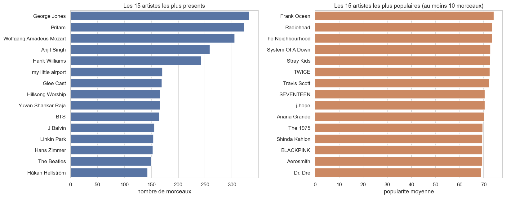
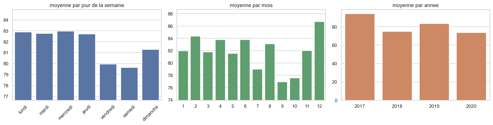
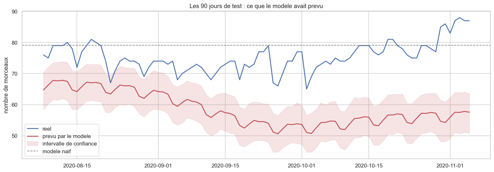

# 🎵 Tendances du streaming musical : tests statistiques et prévision Prophet


114 000 morceaux Spotify et 9,8 millions de lignes de classements. J'ai décrit un catalogue musical avec de vrais tests statistiques, puis j'ai essayé de prévoir la place de la Pop dans le Top 200 mondial. **Mon modèle Prophet s'est fait battre par une simple moyenne des 7 derniers jours, et je l'ai laissé tel quel.**

---

## 📖 Contexte

MeloWave (cas fictif) est un distributeur musical indépendant. Il accompagne des labels et des artistes sur les plateformes de streaming. Deux questions m'ont été posées :

1. **Que contient vraiment le catalogue ?** Qualité des données, profil sonore des genres, et trois questions précises à trancher avec des tests, pas avec des graphiques.
2. **Peut-on anticiper la présence d'un genre dans les classements ?** Cas étudié : la Pop, sur le marché mondial, avec une prévision à 6 mois.

Le projet tient en deux notebooks, un par question.

---

## 🎯 Ce que j'ai fait

- Audit qualité et nettoyage d'un catalogue de 114 000 lignes, **en quantifiant chaque ligne retirée**
- Description du catalogue : distributions, asymétrie, valeurs aberrantes (IQR), classements d'artistes, profil sonore de 5 genres
- **Trois tests statistiques** choisis selon la nature des variables, conditions vérifiées avant chaque test, **taille d'effet** à chaque fois
- Construction d'une série quotidienne sur 1 405 jours, avec **diagnostic des jours à zéro**
- Prévision Prophet évaluée sur 90 jours jamais vus, **comparée à un modèle naïf**, puis prévision finale à 6 mois

---

## 🔍 Résultats clés

### 1️⃣ 24 259 identifiants répétés, gardés après vérification

Le fichier compte 114 000 lignes mais seulement 89 741 `track_id` différents. Le réflexe serait un `drop_duplicates("track_id")`. Je ne l'ai pas fait : un morceau rangé dans plusieurs genres apparaît une fois par genre. Baby Blue de Badfinger revient 9 fois, seul le genre change.

Avant de trancher, j'ai vérifié sur tout le catalogue que les lignes d'un même morceau ne se contredisent jamais :

```python
# est-ce que les caracteristiques audio varient pour un meme morceau ?
variations = df.groupby("track_id")[audio + ["popularity"]].nunique().max()
print(variations)

# Résultat : 1 pour les 10 variables audio, 2 pour la popularité
# (720 morceaux seulement, 1,7 point d'écart en moyenne)
```

J'ai donc travaillé avec deux tables :
- `df_genre` (113 549 lignes) : un morceau dans un genre, pour comparer les genres
- `df_morceaux` (89 740 lignes) : un morceau une seule fois, pour les distributions et les classements

Au final je n'ai retiré que **451 lignes sur 114 000 (0,4 %)** : 450 doublons stricts et une ligne sans titre ni durée. Les 163 mesures impossibles (tempo ou signature rythmique à 0) sont marquées, pas supprimées.

### 2️⃣ Être présent et être écouté, ce sont deux classements différents



Aucun des 15 artistes les plus présents n'est dans les 15 plus écoutés. George Jones a 332 morceaux dans le catalogue, Frank Ocean en a 21 avec 75 de popularité moyenne. Pour le classement de droite, j'impose un minimum de 10 morceaux : sans ce seuil, un artiste avec un seul titre viral passerait premier.

Autre point : 9 347 morceaux ont une popularité nulle, et ils se concentrent sur quelques genres (68 % des morceaux de jazz sont à zéro). J'y vois plutôt un biais de collecte (rééditions, doublons d'enregistrement) qu'un public qui n'écoute pas de jazz. Je n'ai donc pas classé les genres du meilleur au pire.

### 3️⃣ Les tests statistiques : la taille d'effet avant la p-value

Shapiro-Wilk rejette la normalité sur toutes les variables (p ≤ 2,7e-20 sur un échantillon de 5 000 morceaux). Je suis donc parti sur les tests non paramétriques.

| Question | Test retenu | Pourquoi ce test | Taille d'effet |
|---|---|---|---|
| Les variables audio sont-elles liées ? | Spearman | deux variables quantitatives, normalité rejetée | ρ = 0,753 (energy et loudness) |
| La popularité change-t-elle selon le genre ? | Kruskal-Wallis | 114 groupes, variances inégales (Levene) | ε² = 0,272 |
| Le contenu explicite dépend-il du genre ? | khi carré | deux variables qualitatives, 0 case sous 5 attendus | V de Cramér = 0,402 |

Avec 113 549 lignes, les trois p-values tombent à zéro. Elles ne suffisent donc pas : **je lis la taille d'effet pour savoir si le lien compte vraiment**. Par exemple, environ 27 % de l'écart de popularité entre morceaux vient du genre.

```python
# taille d'effet : la part de l'ecart de popularite expliquee par le genre
H, p_kruskal = stats.kruskal(*groupes)
epsilon2 = (H - k + 1) / (n - k)

# Résultat : H = 30 955, epsilon2 = 0,272
```

### 4️⃣ Cinq jours à zéro, et aucun vrai zéro

Sur 1 405 jours, la Pop tombe à zéro 5 fois. J'ai regardé le classement complet de ces jours-là :

| Date | Lignes ce jour-là | Dont genre renseigné |
|---|---|---|
| 23/02/2017 | 0 | 0 |
| 30/05/2017 | 0 | 0 |
| 31/05/2017 | 0 | 0 |
| 02/06/2017 | 0 | 0 |
| 09/06/2018 | 200 | 0 |

Quatre jours sont des trous de collecte (aucun morceau ce jour-là). Le 09/06/2018, le classement est bien là, mais la colonne genre est vide pour les 200 morceaux. Je les ai passés en valeur manquante plutôt qu'en zéro, sinon le modèle aurait appris des chutes brutales qui n'ont jamais eu lieu.

### 5️⃣ Le vendredi est un point bas pour la Pop



La Pop occupait 94,1 places sur 200 en moyenne en 2017, et 73,7 en 2020. Elle reste le premier genre du classement mais elle recule.

Le vendredi (79,9) et le samedi (79,6) sont les deux points bas de la semaine. Le vendredi, les nouveautés de tous les genres entrent dans le classement et poussent dehors des titres Pop déjà installés. Le hip hop le montre : sa part passe de 12,3 % du lundi au jeudi à 13,8 % le vendredi. Sur l'année, décembre est le point haut (86,7).

### 6️⃣ Le modèle battu par une moyenne



J'ai mis de côté les 90 derniers jours (du 08/08 au 05/11/2020) sans y toucher. Le réglage de Prophet (`changepoint_prior_scale`) a été choisi sur un deuxième découpage, à l'intérieur de l'entraînement, pour ne jamais regarder le test avant de juger le modèle.

| Modèle | MAE (morceaux par jour) |
|---|---|
| Modèle naïf : moyenne des 7 derniers jours | **4,99** |
| Prophet | 16,92 (RMSE 18,14, MAPE 22,2 %) |

Le biais vaut -16,92, presque exactement le MAE : le modèle ne se trompe pas au hasard, il prévoit trop bas tous les jours. Les dernières semaines d'entraînement tombaient dans un creux autour de 68 morceaux par jour, Prophet l'a pris pour la nouvelle tendance, et la série est remontée juste après. Le réel ne tombe dans l'intervalle de confiance qu'**1 jour sur 90**.

J'aurais pu essayer d'autres réglages jusqu'à en trouver un meilleur sur ces 90 jours. Mais le score n'aurait plus rien mesuré : le modèle aurait vu sa note avant d'être jugé. J'ai gardé le résultat tel quel.

Le modèle a quand même bien appris la tendance qui descend, le creux du vendredi et le pic de décembre. C'est sur le niveau qu'il se trompe.

---

## 💡 Conclusion

> **Sur cette série, une moyenne récente prévoit mieux le niveau que Prophet. Le modèle reste utile pour les rythmes.**

- Pour planifier une sortie Pop : viser décembre plutôt que septembre, et éviter le vendredi si l'objectif est d'entrer dans le Top 200. Ces deux conseils reposent sur les rythmes, que le modèle capte bien.
- Pour un niveau à court terme, la moyenne des dernières semaines est plus fiable, et c'est mesuré.
- La prévision à 6 mois (81,9 morceaux par jour en moyenne) prolonge le passé. Elle ne peut pas voir venir un artiste qui change la donne ou un changement de règles chez Spotify.

---

## 🗂️ Les données

| Fichier | Contenu | Dans le repo |
|---|---|---|
| `spotify-tracks-dataset-detailed.csv` | 114 000 morceaux, 114 genres, 20 colonnes (variables audio, popularité, genre) | ✅ 19 Mo |
| `release_dates_genre_2017_2020.csv` | 51 753 sorties avec leur date et leur genre | ✅ 5,8 Mo |
| `chart_tracks_genre_2017_2020.csv` | Top 200 quotidien de 35 marchés, 2017-2020, 9,8 millions de lignes | ❌ 1,4 Go |

Le fichier des classements dépasse la limite de GitHub (100 Mo). Le notebook 2 est publié déjà exécuté, tous les résultats et graphiques sont visibles sans le relancer.

Le catalogue vient du [Spotify Tracks Dataset](https://www.kaggle.com/datasets/maharshipandya/-spotify-tracks-dataset) publié sur Kaggle par Maharshi Pandya (base sous licence ODbL), sans sa colonne d'index.

---

## 🛠️ Technologies utilisées

- **Python 3.12**
- **Pandas / NumPy** : nettoyage, agrégations, construction de la série quotidienne
- **SciPy** : Shapiro-Wilk, Levene, Spearman, Pearson, Kruskal-Wallis, ANOVA, khi carré
- **Prophet** : modélisation de la tendance et des rythmes hebdomadaire et annuel
- **Matplotlib / Seaborn** : graphiques
- **JupyterLab**

---

## 📂 Structure du projet

```
.
├── README.md
├── requirements.txt
├── notebooks/
│   ├── 01_analyse_catalogue.ipynb   # audit, description, tests statistiques
│   └── 02_prevision_genre.ipynb     # série quotidienne, Prophet, prévision à 6 mois
├── data/
│   ├── spotify-tracks-dataset-detailed.csv
│   └── release_dates_genre_2017_2020.csv
└── images/                          # graphiques repris dans ce README
```

---

## 🚀 Installation et utilisation

```bash
git clone https://github.com/Heltondsm/analyse-streaming-musical.git
cd analyse-streaming-musical
pip install -r requirements.txt
cd notebooks
jupyter lab
```

Le notebook 1 se relance tel quel. Pour relancer le notebook 2, il faut placer le fichier des classements dans `data/` sous le nom `chart_tracks_genre_2017_2020.csv`.

Le notebook 2 est paramétré dans sa première cellule. Pour étudier le hip hop sur le marché français, il suffit de changer deux valeurs :

```python
GENRE = "pop"
MARCHE = "Global"
JOURS_TEST = 90        # les 90 derniers jours servent a verifier le modele
JOURS_PREVISION = 180  # 6 mois de prevision finale
```

---

## 📈 Compétences démontrées

### Statistiques
- ✅ Choix du test selon la nature des variables, conditions vérifiées avant (normalité, variances, effectifs attendus)
- ✅ Lecture des tailles d'effet (ρ, ε², η², V de Cramér) et pas seulement des p-values
- ✅ Distributions : asymétrie, aplatissement, valeurs aberrantes par IQR

### Séries temporelles
- ✅ Série construite sur une grille de dates complète, faux zéros diagnostiqués
- ✅ Découpage chronologique, réglage choisi sans regarder le test
- ✅ Comparaison à un modèle naïf, lecture du biais et de la couverture de l'intervalle

### Données
- ✅ Doublons vérifiés avant d'être supprimés, chaque exclusion quantifiée
- ✅ Chargement d'un fichier de 1,4 Go en ne lisant que 3 colonnes (598 Mo en mémoire)
- ✅ Biais de collecte repérés et signalés au lieu d'être interprétés

---

## 📧 Contact

**Helton Dos Santos Moreira**
Data Analyst / Data Engineer | 10 ans d'expérience business (retail et e-commerce)

- 📧 Email : heltonmail8@gmail.com
- 💼 LinkedIn : [in/helton-dsm-data](https://linkedin.com/in/helton-dsm-data)
- 🐙 GitHub : [Heltondsm](https://github.com/Heltondsm)

---

## 🔗 Autres projets

- [Pipeline dbt : profils sociodémographiques](https://github.com/Heltondsm/dbt-demographics-pipeline), Snowflake et DuckDB, 26 tests, reproductible en une commande
- [Pipeline de veille du marché de l'emploi](https://github.com/Heltondsm/job-market-pipeline), APIs France Travail et INSEE Sirene, 698 offres et 1 166 entreprises en 11 secondes
- [Prévision de ventes e-commerce : SARIMA](https://github.com/Heltondsm/ecommerce-sales-analysis-sarima), séries temporelles, 64 combinaisons testées, intervalles de confiance

- [Tableau de bord Power BI : portefeuille de projets](https://github.com/Heltondsm/powerbi-portefeuille-projets-rls), 104 projets dans 52 pays, sécurité au niveau des lignes sur 3 rôles, 16 mesures DAX
---

**Projet réalisé entre juillet et septembre 2026**
